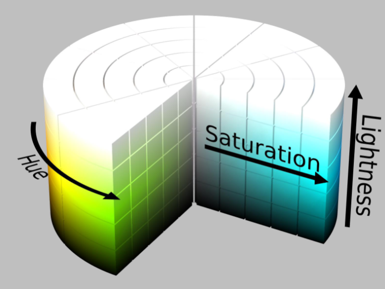
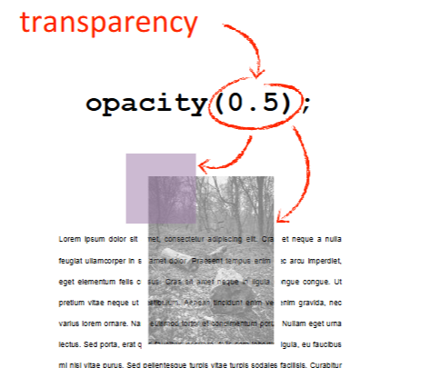
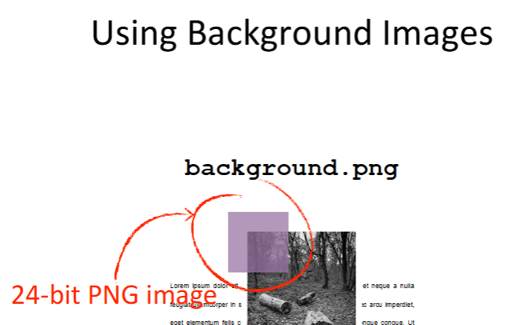

# CSS Color Guide

Concise reference for common CSS color models, syntax, and practical usage.

## Color Models

### Subtractive Color (Printing)
Used in inkjet printers and physical media (CMYK):
- **Yellow**
- **Magenta**
- **Cyan**
- **Key (Black)**


### Additive Color (Digital)
Used in digital displays and web applications (RGB):
- **Red**
- **Green**
- **Blue**

## CSS Color Syntax Notations

### RGB(A) - Red, Green, Blue (Alpha)
Use RGB(A) to specify colors with red, green, and blue values plus optional transparency.


**Usage:** `rgb(255, 0, 0)` or `rgba(255, 0, 0, 0.5)`

### HSL(A) - Hue, Saturation, Lightness (Alpha)
Use HSL(A) for intuitive color selection based on hue, saturation, and lightness plus optional transparency.


#### HSL(A) 3D Diagram


**Usage:** `hsl(0, 100%, 50%)` or `hsla(0, 100%, 50%, 0.5)`

### Hexadecimal Color Notation
Hexadecimal is a compact RGB representation. Use 3 or 6 hex digits (with optional alpha).


**Usage:** `#FF0000`, `#F00`, `#FF000080` (with alpha)

### Other CSS Color Syntax Notations
- Named colors: `red`, `blue`, `transparent`
- `currentColor`: Inherits the current text color
- CSS custom properties: `var(--primary-color)`

## Color Properties

### Alpha vs Opacity

Key differences between alpha in color values and element `opacity`:

| Property | Definition | Inheritance | Performance |
|----------|-----------|-------------|-------------|
| **Alpha** | Affects only that property | Not inherited | More targeted control |
| **Opacity** | Affects element and all children | Inherited by children | Can reduce text clarity |

## Gamuts, Color Spaces, and Web Standards

Summary of display limits and terminology:

- **Gamut**: The range of colors a device can display
- **Color Space**: A model for representing colors (RGB, HSL, CMYK, etc.)
- **Web Standards**: Colors supported across modern browsers


## Applying Color to HTML Elements

Common CSS properties that accept colors:

```css
/* Text color */
color: rgb(51, 51, 51);

/* Background color */
background-color: #f0f0f0;

/* Border color */
border-color: hsla(200, 100%, 50%, 0.8);

/* Box shadow with color */
box-shadow: 0 4px 6px rgba(0, 0, 0, 0.1);
```

### Opacity in CSS

Use `opacity` to affect the entire element, or alpha in a color value to affect a single property.

```css
/* Entire element becomes semi-transparent */
opacity: 0.5;

/* Only the background is semi-transparent */
background-color: rgba(0, 0, 0, 0.5);
```


