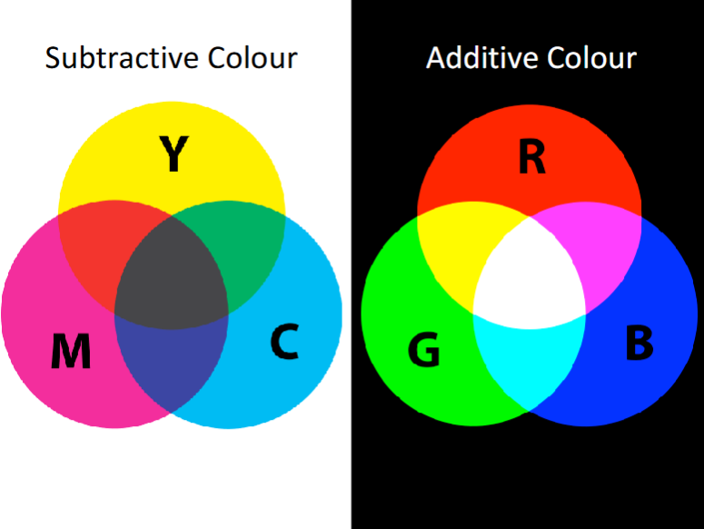
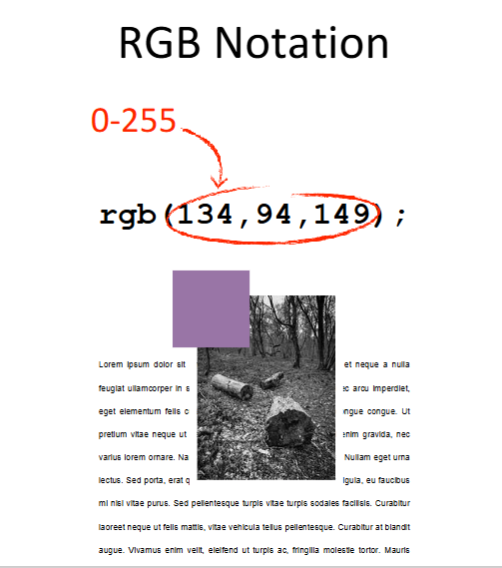
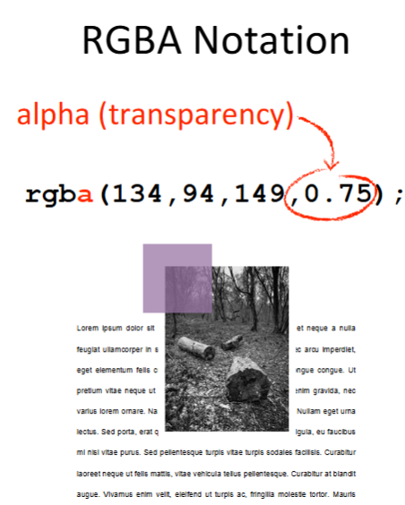
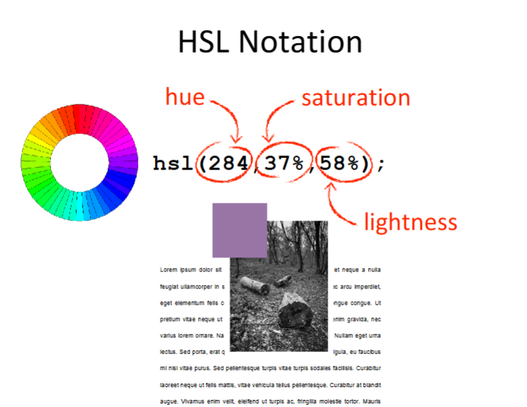
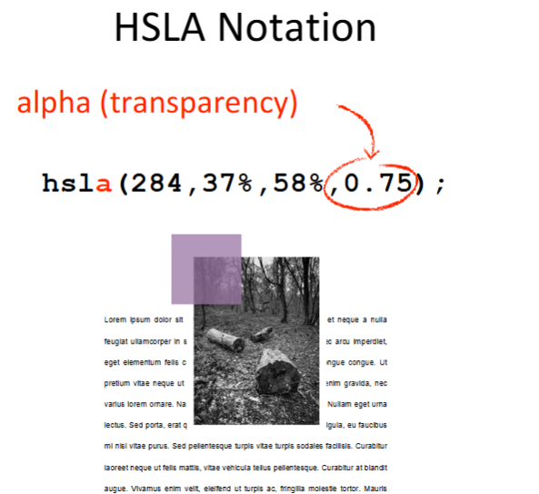
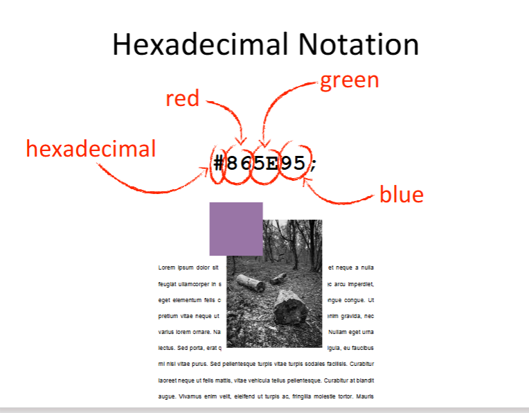
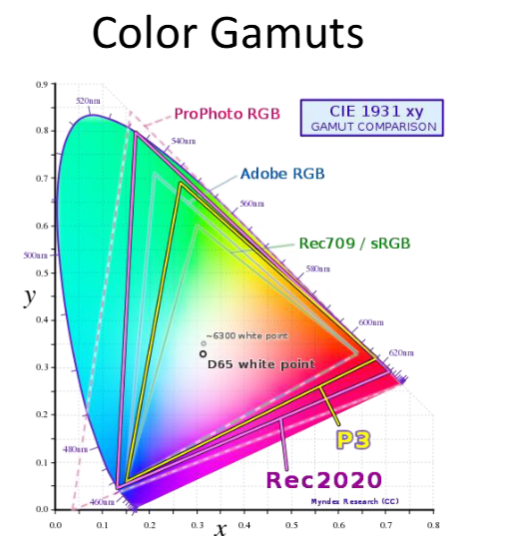

# CSS Color Guide

## Color Models

### Subtractive Color (Printing)
Used in inkjet printers and physical media:
- **Yellow**
- **Magenta**
- **Cyan**
- **Key (Black)**



### Additive Color (Digital)
Used in digital displays and web applications:
- **Red**
- **Green**
- **Blue**

## CSS Color Syntax Notations

### RGB(A) - Red, Green, Blue (Alpha)
Apply the RGB(A) CSS color syntax/notation to specify colors using red, green, and blue values.




**Usage:** `rgb(255, 0, 0)` or `rgba(255, 0, 0, 0.5)`

### HSL(A) - Hue, Saturation, Lightness (Alpha)
Apply the HSL(A) color syntax/notation for intuitive color selection based on hue, saturation, and lightness.




**Usage:** `hsl(0, 100%, 50%)` or `hsla(0, 100%, 50%, 0.5)`

### Hexadecimal Color Notation
Apply hexadecimal color syntax/notation as shorthand for RGB values.



**Usage:** `#FF0000` or `#F00`

### Other CSS Color Syntax Notations
- Named colors: `red`, `blue`, `transparent`
- `currentColor`: Inherits the current text color
- CSS custom properties: `var(--primary-color)`

## Color Properties

### Alpha vs Opacity

Demonstrate the key differences between CSS alpha and CSS opacity:

| Property | Definition | Inheritance | Performance |
|----------|-----------|-------------|-------------|
| **Alpha** | Affects only that element | Not inherited | Lighter rendering |
| **Opacity** | Affects element and all children | Inherited by children | Heavier rendering |

## Gamuts, Color Spaces, and Web Standards

Describe gamuts, color spaces and Web color standards:

- **Gamut**: The range of colors that can be displayed by a device
- **Color Space**: A model for representing colors (RGB, HSL, CMYK, etc.)
- **Web Standards**: Colors supported across all modern browsers



## Applying Color to HTML Elements

Using CSS to apply color properties to HTML elements:

```css
/* Text color */
color: rgb(51, 51, 51);

/* Background color */
background-color: #f0f0f0;

/* Border color */
border-color: hsla(200, 100%, 50%, 0.8);

/* Box shadow with color */
box-shadow: 0 4px 6px rgba(0, 0, 0, 0.1);
```